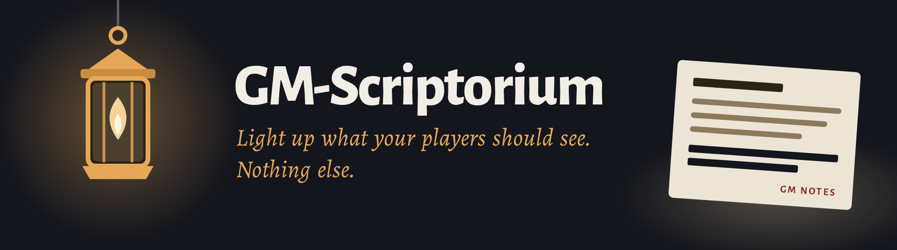

# DrNoisys Softworks

We're a small software workshop building tools for tabletop GMs, the kind of thing you build
because you needed it yourself first.

## Projects

### [GM-Scriptorium](https://github.com/DrNoisys-Softworks/gm-scriptorium)

Turn your campaign vault into a player-safe website. Leak checks keep GM notes off the site, and
setup runs in your browser.

It builds on the [gm-apprentice](https://github.com/AntTheLimey/gm-apprentice) generator.
